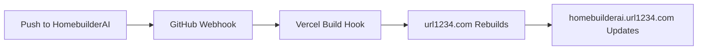

# 🏠 HomebuilderAI → url1234.com Automated Integration

## 🎯 **The Magic: Zero-Manual-Work Deployment**

**You'll never have to remember to run anything!** Here's what happens automatically:



## 🚀 **One-Time Setup (5 Minutes)**

### Step 1: Run the Integration Setup
```bash
cd /Users/devenspear/VibeCodingProjects/url1234.com
./scripts/setup-homebuilder-integration.sh
```

### Step 2: Configure Webhooks
```bash
./scripts/configure-webhooks.sh
```

**That's it! 🎉**

## 📋 **How It Works**

### **Automated Workflow:**
1. **You work** in `/Users/devenspear/VibeCodingProjects/homebuilder-AI`
2. **You push** to GitHub: `git push origin main`
3. **GitHub webhook** triggers Vercel build hook automatically
4. **Vercel rebuilds** url1234.com with latest HomebuilderAI content
5. **homebuilderai.url1234.com** updates instantly

### **Technical Implementation:**
- **Git Submodule**: HomebuilderAI repo linked as submodule in url1234.com
- **GitHub Actions**: Monitors for changes and syncs automatically
- **Vercel Integration**: Webhook triggers rebuild on HomebuilderAI updates
- **Smart Routing**: Subdomain seamlessly serves HomebuilderAI content

## 🛠️ **Development Workflow**

### **Daily Development:**
```bash
# Work in your HomebuilderAI project (as usual)
cd /Users/devenspear/VibeCodingProjects/homebuilder-AI
npm run dev

# Make changes, test, commit
git add .
git commit -m "Add new feature"
git push origin main
# 🎉 homebuilderai.url1234.com updates automatically!
```

### **No Manual Steps Required:**
- ❌ No copying files
- ❌ No running sync scripts
- ❌ No remembering deployment steps
- ❌ No switching between projects
- ✅ Just push to GitHub = live updates!

## 🎛️ **Configuration Files**

### **GitHub Actions Workflow**
- **File**: `.github/workflows/sync-homebuilder.yml`
- **Triggers**: HomebuilderAI repository updates
- **Action**: Automatically syncs and rebuilds

### **Vercel Configuration**
- **Build Hook**: Triggers deployment when HomebuilderAI updates
- **Submodule Support**: Automatically pulls latest HomebuilderAI code
- **Smart Routing**: homebuilderai.url1234.com → HomebuilderAI content

### **Integration Scripts**
- **setup-homebuilder-integration.sh**: One-time setup
- **configure-webhooks.sh**: Webhook configuration helper

## 🌍 **Live URLs**

- **HomebuilderAI App**: https://homebuilderai.url1234.com
- **Admin Dashboard**: https://url1234.com/admin
- **Source Repository**: https://github.com/devenspear/HomebuilderAI

## 🔧 **Troubleshooting**

### **If homebuilderai.url1234.com doesn't update:**
1. Check GitHub webhook delivery in repo settings
2. Check Vercel deployment logs
3. Verify submodule is tracking the right branch

### **Manual sync (if needed):**
```bash
cd /Users/devenspear/VibeCodingProjects/url1234.com
git submodule update --remote src/homebuilder-source
git add . && git commit -m "Manual HomebuilderAI sync"
git push
```

### **Reset integration:**
```bash
./scripts/setup-homebuilder-integration.sh
```

## 📊 **Benefits of This Approach**

### **For Development:**
- ✅ **Independent Projects**: Keep HomebuilderAI as standalone project
- ✅ **Normal Workflow**: Work in HomebuilderAI as usual
- ✅ **Version Control**: Clean separation of concerns
- ✅ **Testing**: Test HomebuilderAI independently

### **For Deployment:**
- ✅ **Zero Manual Work**: Push to GitHub = automatic deployment
- ✅ **Fast Updates**: Changes appear on subdomain within minutes
- ✅ **Reliable**: Built on GitHub + Vercel infrastructure
- ✅ **Scalable**: Easy to add more subdomains

### **For Management:**
- ✅ **Single Dashboard**: Manage all subdomains from url1234.com/admin
- ✅ **Consistent URLs**: homebuilderai.url1234.com (professional)
- ✅ **Easy Monitoring**: All deployments in one Vercel project

## 🎉 **Result: The Perfect Setup**

**You get:**
- Independent HomebuilderAI development
- Automatic deployment to professional subdomain
- Zero manual maintenance
- Seamless integration with url1234.com ecosystem

**You avoid:**
- File copying nightmares
- Manual deployment steps
- Remembering sync procedures
- Project maintenance overhead

---

**🚀 Ready to start? Run the setup scripts and push your first change to see the magic!**